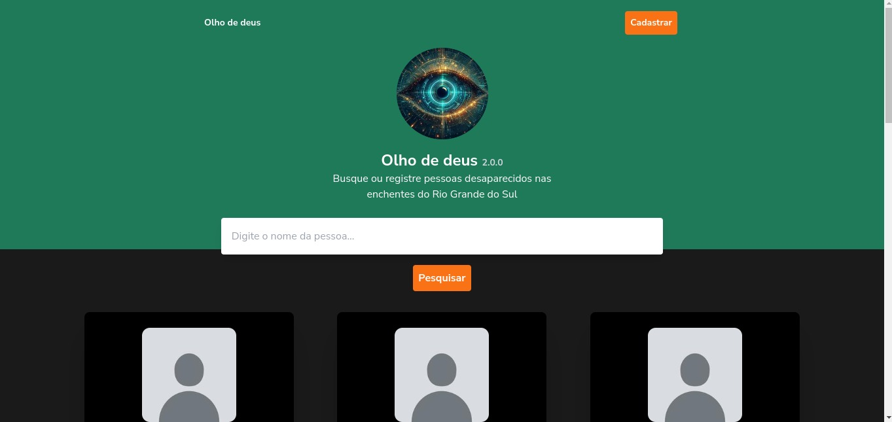

# Projeto Olho de deus

   

## Sobre o projeto
A plataforma visa cadastrar pessoas desaparecidas nas enchendos do Rio Grande do Sul, possibilitando a busca por familiares ou pessoas próximas. Todo o projeto é e sempre será de código aberto e não cobrará nenhum valor para seus usuários.

### Instalação
- nvm use
- preencha o `.env` de acordo com o `env.example`
- npm install
- npm run dev

### Contribuição
Se você quer contribuir com o projeto, siga esses passos:

- Faça um fork do projeto no github
- Crie uma branch com a feature ou bug que você irá trabalhar (`git checkout -b feature/nomeDaFeature`)
- Desenvolva e commite suas alterações (`git commit -m 'Alterações xyz'`)
- Faça o push das alterações (`git push origin feature/AmazingFeature`)
- Abra um Pull Request para a branch `work`

Para garantir que as contribuições sejam integradas de maneira suave, por favor, siga estas guidelines:

- `Issues`: Utilize as issues para reportar bugs, solicitar novas funcionalidades ou discutir mudanças significativas. Antes de abrir uma nova issue, verifique se já não existe uma semelhante.
- `Commits`: Mantenha seus commits pequenos e focados. Escreva mensagens de commit claras e descritivas.
- `Pull Requests`: Descreva detalhadamente o que sua pull request faz. Inclua links para quaisquer issues relacionadas e forneça contexto para entender a mudança.
- `Código`: Mantenha a consistência com o estilo de código existente utilizando o linter.
